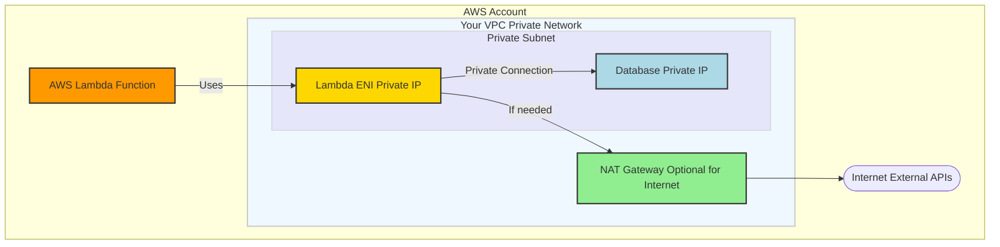
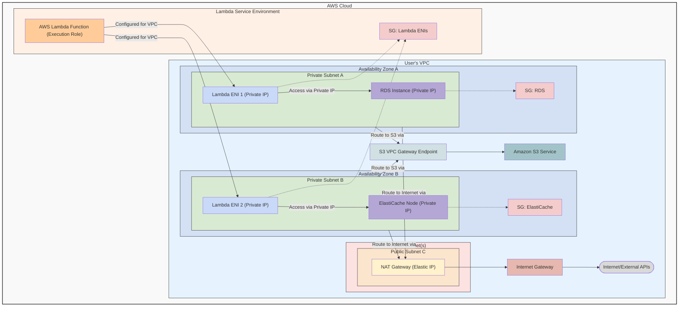

# Nick's Bench Progress

## Progress: 24/54 tasks completed
<!-- Progress bar visual representation -->

## Progress: Udemy Ultimate AWS Certified Developer Associate 2025 DVA-C02
<!-- Progress bar visual representation -->

## Burndown Chart
%27,tension:0.1,pointRadius:2},{label:%27Actual%27,data:[54,51,51,51,51,47,45,43,42,42,42,41,39,37,35,33,33,33,32,30,null,null,null,null,null,null,null,null,null,null,null,null,null,null],fill:false,borderColor:%27rgb(255,99,132)%27,tension:0.1,pointRadius:2}]},options:{title:{display:true,text:%27Task%20Burndown%20(54%20tasks,%2019%20Workdays%20to%20May%2030)%27},scales:{yAxes:[{ticks:{beginAtZero:true,suggestedMax:60},scaleLabel:{display:true,labelString:%27Tasks%20Remaining%27}}],xAxes:[{scaleLabel:{display:true,labelString:%27Date%27}}]}}})

# AWS Developer–Associate 90% Pass Probability Plan  
*(Workdays-only, starts May 2, preserves nights & weekends)*  

## Guiding Principles  
- **Pomodoro 25 / 5 cadence** → sustained concentration without fatigue.  
- **Visible progress** → log a short note or screenshot at day's end in this doc.  
- **Spaced repetition, not cramming** → review flash-cards after every module.  
- **Soft stop 4:30 p.m.** → evenings + weekends are family time.
- **Using Ankidroid app** → review flash cards during spare cycles on weekends
- **Buffer time** → 30-min buffer after hands-on sessions for troubleshooting
- **Daily review** → 15-min review of previous day's concepts

## Contingency  
*If any full-length practice score is below 75% by **May 28**, reschedule the exam to the week of **June 3** (voucher reschedule is free).*  

## After the Exam  
- Migrate first two IoT Cloud Functions from JavaScript to Go during the week of June 3.  
- Begin drafting the **"Kunai Serverless Starter Kit"** repo & Terraform scripts.

---

## Fri May 2  
- [✅] 1. **Read the AWS Developer – Associate Exam Guide** — PDF download.  [oai_citation:0‡Amazon Web Services, Inc.](https://aws.amazon.com/certification/certified-developer-associate/?utm_source=chatgpt.com)  
- [✅] 2. **Udemy kick-off 20 of 490 completed
- [✅] 3. Create a **Gap List** page in this repo noting weak domains.

Notes: IAM-Identity and Access Management is a global service 

Gaps: Since I prevously was taking the course for practitioner, there is overlap, but not the 
depth required for my role. The developer content already feels much more apropriate. 

Projected course days remaining: 24 days. Expecting following days to pick up the pace
since I started the courses mid day. 

---

## Mon May 5  
*Vacation Day (Volunteered) *

---

## Tue May 6 
- [✅] 1. Udemy Section 4 – IAM & CLI 1 h 28 m 
- [✅] 2. Udemy Section 5 - EC2 Storage fundamentals. 2x speed review 
- [✅] 3. Udemy Section 6 – EC2 Storage 1 h 5 m
- [✅] 4. Complete the section quizzes and jot **key takeaways** for IAM and EC2 in your bench log. 

Key terms:

- Subnet: A contiguous range of IP addresses within a VPC
- VPC: Virtual Private Cloud - Isolated network environment in AWS
- Security groups: Virtual firewall that controls inbound and outbound traffic for AWS resources
- IAM: Identity and Access Management - AWS service for managing user access and permissions
- CLI: Command Line Interface - Tool for interacting with AWS services via command line
- EC2: Elastic Compute Cloud - Virtual servers in the cloud
- S3: Simple Storage Service - Object storage service for storing and retrieving data
- Classic ports to know: 22 SSH and secure FTP, 21 FTP, 80 HTTP, 443 HTTPS, 3389 RDP (Remote Desktop Protocol for Windows)
- IPAM: IP Address Manager - Helps to plan, track and manage IP addresses for workloads and on-prem networks
- Local EC2 Instance Store: High performance temporary block-level storage
- IOPS: Input/Output Operations Per Second - Measure of storage performance
- EBS: Elastic Block Storage - Persistent block storage volumes for EC2 instances
    - gp2 General Purpose SSD (older generation)
        - Baseline of 3 IOPS/GiB, up to 16,000 IOPS per volume
        - Volume size 1 GiB to 16 TiB
        - Burst up to 3,000 IOPS
        - Good for boot volumes, dev/test environments
    - gp3 General Purpose SSD (current generation)
        - Baseline 3,000 IOPS and 125 MiB/s throughput
        - Can increase up to 16,000 IOPS and 1,000 MiB/s throughput
        - Independent scaling of IOPS and throughput
        - 20% cheaper than gp2
    - io1/io2 Provisioned IOPS SSD
        - Highest performance SSD volume
        - Up to 64,000 IOPS per volume
        - io2 is more durable and more IOPS per GiB
    - st1 Throughput Optimized HDD
        - Low-cost HDD volume
        - Baseline throughput of 40 MB/s per TB
        - Burst up to 250 MB/s per TB
        - Good for big data, data warehouses, log processing
    - sc1 Cold HDD
        - Lowest cost HDD volume
        - Base 12 MB/s per TB
        - Burst up to 80 MB/s per TB
        - Good for infrequently accessed data
- EFS: Elastic File System - Scalable, fully managed NFS file system
---

## Wed May 7  —  ✳ + ⏩
- [✅] 1. ✳ **Udemy Section 10 – VPC Fundamentals** (≈ 0.6 h)
- [✅] 2. ⏩ **Udemy Section 7 – ELB & Auto-Scaling** (≈ 1.2 h)  
Created VPC anki cards

## Thu May 8  —  ✳ + ⏩  
- [✅] 1. ✳ **Udemy Section 11 – Amazon S3 Intro** (≈ 2.1 h)  
- [✅] 2. ⏩ **Udemy Section 8 – AWS Fundamentals: RDS + Aurora + ElastiCache** (≈ 0.8 h)  
11
## Fri May 9  —  ✳ + ⏩
- [✅] 1. ✳ ** START: Udemy Section 21 – AWS Lambda Deep Dive** (≈ 3.1 h)

## Mon May 12  —  ✳ + ⏩  
- [✅] 1. ⏩ **Udemy Section 9 – Route 53 DNS & Routing** (≈ 1.5 h speed-run)

Notes:
Supports DNS record types 
- A maps a hostname to IPV4
- AAAA maps a hostname to IPV6
- CNAME maps a hostname to another hostname
- NS name servers for the hosted zone. Controls how traffic is routed for a domain

## Tue May 13  —  Hands-on Focus  
- [✅] 1. **Read Lambda Go runtime docs** (≈ 30 m) — [oai_citation:3‡AWS Documentation](https://docs.aws.amazon.com/lambda/latest/dg/lambda-golang.html?utm_source=chatgpt.com)  
- [✅] 2. ** AWS Integration & Messaging: SQS, SNS & Kinesis 

## Wed May 14  —  S3 Completion
- [✅] 6. ⏩ Udemy Section 13 – Advanced Amazon S3  (0.4 h)
- [✅] 7. ✳  Udemy Section 14 – Amazon S3 Security       (1.0 h) 

## Thu May 15  —  Serverless & Integration
- [✅] 1. ✳  Udemy Section 19 – AWS Integration and Messaging: SQS, SNS & Kinesis (1h 42m) 
   - Create Anki cards
   - Review Anki cards
- [✅] 2. Preview: to know what they are when they come up in the lambda documentation.
   - CloudFront 
   - Elastic Beanstalk
   - CloudFormation 
   - ECR, ECS, Fargate, Docker

## Fri May 16  —  API Completion  
- [✅] 1. ✳ ** FINISHED: Udemy Section 21 – AWS Lambda Deep Dive** (≈ 3.1 h)
- [✅] 2. **Complete & Deploy "Hello Go" API** (≈ 3.0 h)  (Ideally, this should have come after Udemy Section 18 – SAM & CloudFormation)
  - Finalize Go handler (JSON response, error handling, logging)  
  - Build & test locally with AWS SAM  
  - Deploy via SAM CLI → dev stage (API Gateway + Lambda)  
  - Commit code + endpoint URL to GitHub, add screenshot to bench log  

21
## Mon May 19  —  
   - [✅] 1. ✳ **Udemy Section 28 – Step Functions & AppSync** (≈ 2 h deep-study)
   - Message queuing concepts
   - Pub/sub patterns
   - Create Anki cards

## Tue May 20  —  
- [✅] 1. Review all Anki cards. Deep dive into anything not fully understood
- [✅] 2. ⏩ **Udemy Section 15 – CloudFront** (≈ 0.5 h speed-run)
   - CDN fundamentals
   - Edge locations
   - Cache behaviors

## Wed May 21  —  CI/CD & Templates  
- [✅] 1. **Udemy Section 18 – CloudFormation** (≈ 1.5 h)
   - Template structure
   - Best practices
   - Common patterns
   - Review past material

## Thu May 22  —  Practice & Review  
- [✅] 1. ⏩ **Take a Udemy assessment**
   Above average result. Following topics need review:
   - BAA (Business Associate Addendum) & AWS Artifact
   - AWS SAM & CodeStar
   - IAM user JSON policies
   - AWS Amplify & Elasticsearch
   - AWS DataSync vs EBS
   - EC2 instance types (d/c series)
   - Root account usage scenarios
   - Elastic Beanstalk worker environments
   - Amazon Connect
   - Systems Manager capabilities
   - CloudWatch features
   - Network Load Balancer UDP support
   - WAF rule configurations
   - AWS Organizations vs individual accounts
   - CloudFormation Fn::ImportValue
- [✅] 2.⏩ **Udemy Section 12 – AWS CLI, SDK, IAM Roles and Policies** (≈ 30 m)  
- [ ] 3. ⏩ **Udemy Section 16 – Docker, ECS, ECR, Fargate** (≈ 1.2 h speed-run)   - Container concepts
   - ECS clusters
   - ECR repositories
- [ ] 2. ⏩ **Udemy Section 20 – Monitoring & X-Ray** (≈ 1.0 h speed-run)
   - CloudWatch metrics
   - X-Ray tracing
   - Log insights
- [ ] 3. ✳ **Udemy Section 22 – AWS Serverless: DynamoDB** (≈ 2.6 h deep-study)
   - Deep dive into DynamoDB concepts
   - Create Anki cards for key terms
- [ ] 4. ✳ **Udemy Section 23 – API Gateway** (≈ 1.7 h deep-study)
   - REST vs HTTP APIs
   - Integration types
   - Authorization
- [ ] 5. **Udemy Section 24 – Developer Tools** (≈ 1.5 h)
   - CodeBuild
   - CodeDeploy
   - CodePipeline
- [ ] 5. **Udemy Section 25 – SAM** (≈ 1 h)

- [ ] 1. **Tutorials Dojo Practice Exam #1** (65 Q, 130 m)
   - Take exam in exam conditions
   - Mark unsure questions
- [ ] 2. **Review Answers** (≈ 2.0 h)
   - Document incorrect answers
   - Research weak areas
   - Update Gap List
- [ ] 3. **Update Study Materials** (≈ 1.0 h)
   - Add new Anki cards
   - Update cheat sheets
   - Review weak areas
- [ ] 4. **Set up SAM CI/CD pipeline** (≈ 1.0 h)  
  - Run `sam pipeline init --bootstrap`  
  - Verify CodeBuild & CodePipeline stacks deploy successfully  
  - Push `pipeline.yaml` and `buildspec.yml` to GitHub

## Fri May 23  —  Focus Areas  
- [ ] 1. ✳ **Udemy Section 30 – KMS & Encryption** (≈ 1.5 h deep-study)
   - Encryption concepts
   - Key management
   - Best practices
- [ ] 2. **Focus on Weak Areas** (≈ 2.0 h)
   - Review practice exam results
   - Re-watch relevant lectures
   - Complete targeted exercises

## Tue May 27  —  Hands-on Review  
- [ ] 1. **Re-watch Weak-topic Lectures** (≈ 2.0 h)
   - Focus on most challenging areas
   - Take detailed notes
   - Create summary diagrams
- [ ] 2. **Lab: CodeBuild Pipeline** (≈ 1.5 h)
   - Set up CI/CD pipeline
   - Test deployment
   - Document process
- [ ] 3. **Quick Labs Review** (≈ 1.5 h)
   - SQS queue fan-out
   - SNS filtering
   - KMS envelope encryption

## Wed May 28  —  Final Practice  
- [ ] 1. **AWS Official Sample** (20 Q, 40 m)
   - Take in exam conditions
   - Aim for ≥ 90%
- [ ] 2. **Review All Weak Areas** (≈ 2.0 h)
   - Focus on top 3 challenging topics
   - Practice questions
   - Review documentation
- [ ] 3. **Update Study Materials** (≈ 1.0 h)
   - Finalize cheat sheets
   - Update Anki deck
   - Review exam tips

## Thu May 29  —  Final Review  
- [ ] 1. **Final Practice Exam** (100 Q, 180 m)
   - Full-length simulation
   - Strict timing
   - Mark all unsure questions
- [ ] 2. **Comprehensive Review** (≈ 2.0 h)
   - Analyze all practice exams
   - Finalize weak areas
   - Update study materials
- [ ] 3. **Update Cheat Sheets** (≈ 1.0 h)
   - Consolidate all notes
   - Create quick reference
   - Review exam strategies

## Fri May 30  —  Focus Areas  
- [ ] 1. **Focus on Top 3 Weak Areas** (≈ 2.0 h)
   - Deep dive into concepts
   - Practice questions
   - Review documentation
- [ ] 2. **Quick Labs Review** (≈ 1.5 h)
   - Run through key scenarios
   - Verify understanding
   - Document solutions
- [ ] 3. **Flash-card Final Run** (≈ 1.0 h)
   - Review all cards
   - Focus on weak areas
   - Practice recall

## Mon Jun 2  —  Exam Prep  
- [ ] 1. **Pearson Vue System Test** (≈ 30 m)
   - Verify system requirements
   - Test webcam
   - Check internet connection
- [ ] 2. **Final Exam Prep** (≈ 1.0 h)
   - Review exam rules
   - Check required documents
   - Plan exam day schedule
- [ ] 3. **Rest & Light Review** (≈ 1.0 h)
   - Quick review of key concepts
   - No new content
   - Early night

## Tue Jun 3  —  EXAM DAY  
- [ ] 1. **AWS DVA-C02 Exam** (180 m)
   - Arrive early
   - Follow exam rules
   - Use all available time
- [ ] 2. **Write Reflection** (≈ 1.0 h)
   - Document exam experience
   - Note challenging areas
   - Plan next steps
- [ ] 3. **Plan Next Steps** (≈ 1.0 h)
   - Review results
   - Update certification plan
   - Begin post-exam projects

## Contingency  
*If any full-length practice score is below 70 % by **May 22**, reschedule the exam to the week of **June 2** (voucher reschedule is free).*  

## Burnout Safeguards  
- 5-min walk + hydration every two Pomodoros.  
- Box-breathing if anxiety spikes.  
- Friday Loom recap instead of late-night catch-up coding.

## After the Exam  
- Migrate first two IoT Cloud Functions from JavaScript to Go during the week of May 19.  
- Begin drafting the **"Kunai Serverless Starter Kit"** repo & Terraform scripts.

## Simple Example Lambda Arch

## More Complete Example Lambda Arch

### 1. Route Table for Private Subnets (PVT_SUBNET_A and PVT_SUBNET_B)

These subnets house your Lambda ENIs (ENI_A, ENI_B), the RDS instance (RDS_A), and the ElastiCache node (EC_B). They need to:
Access other resources within the VPC.
Reach the internet via the NAT Gateway.
Access Amazon S3 via the S3 VPC Gateway Endpoint.
The route table associated with PVT_SUBNET_A and PVT_SUBNET_B would have the following entries:
| Destination | Target | Purpose |
| :----------------- | :------------------------------------- | :---------------------------------------------------------------------- |
| 10.0.0.0/16 | local | Enables communication with all resources within the VPC. |
| 0.0.0.0/0 | nat-xxxxxxxx (ID of your NAT Gateway NAT_GW) | Routes all other outbound traffic (to the internet) to the NAT Gateway. |
| pl-yyyyyyyy (S3 Prefix List) | vpce-zzzzzzzz (ID of your S3 VPC Endpoint S3_VPCE) | Routes traffic destined for Amazon S3 to the S3 VPC Gateway Endpoint. |
- pl-yyyyyyyy: This is an AWS-managed prefix list ID that represents the IP address ranges for Amazon S3 in that specific AWS Region.

### 2. Route Table for the Public Subnet (PUB_SUBNET_C)

This subnet is "public" because it has a direct route to the Internet Gateway (IGW). The NAT Gateway (NAT_GW) itself resides in this subnet and uses this route table to send traffic to the internet.
The route table associated with PUB_SUBNET_C would have:
| Destination | Target | Purpose |
| :-------------- | :----------------------------------- | :--------------------------------------------------------------------------- |
| 10.0.0.0/16 | local | Enables communication with all resources within the VPC. |
| 0.0.0.0/0 | igw-aaaaaaaa (ID of your Internet Gateway IGW) | Routes all other outbound traffic directly to the Internet Gateway. |