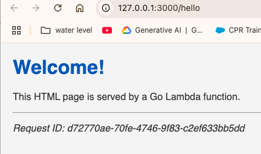
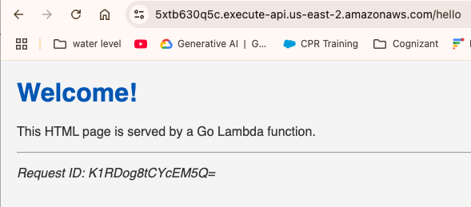

# Nick's Bench Progress

## Progress: 60/60 tasks completed
<!-- Progress bar visual representation -->

## Progress: Udemy Ultimate AWS Certified Developer Associate 2025 DVA-C02
<!-- Updating manually, no touchy -->

## Burndown Chart
%27,tension:0.1,pointRadius:2},{label:%27Actual%27,data:[57%2Cnull%2Cnull%2Cnull%2C53%2C51%2C49%2C48%2Cnull%2Cnull%2C47%2C45%2C43%2C41%2C39%2Cnull%2Cnull%2C38%2C36%2C35%2C32%2C30%2Cnull%2Cnull%2Cnull%2C29%2C28%2C26%2C24%2Cnull%2Cnull%2C21%2C19%2C15%2C12%2C10%2Cnull%2Cnull%2C8%2C6%2C5%2C4%2C3%2C2%2C1%2C0],fill:false,borderColor:%27rgb(255,99,132)%27,tension:0.1,pointRadius:2}]},options:{title:{display:true,text:%27Task%20Burndown%20(60%20tasks,%20Completed%20Jun%2018)%27},scales:{yAxes:[{ticks:{beginAtZero:true,suggestedMax:65},scaleLabel:{display:true,labelString:%27Tasks%20Remaining%27}}],xAxes:[{scaleLabel:{display:true,labelString:%27Date%27}}]}}})

# AWS Developer–Associate 90% Pass Probability Plan  
*(Workdays-only, starts May 2, preserves nights & weekends)*  

## Guiding Principles  
- **Pomodoro 25 / 5 cadence** → sustained concentration without fatigue.  
- **Visible progress** → log a short note or screenshot at day's end in this doc.  
- **Spaced repetition, not cramming** → review flash-cards after every module.  
- **Soft stop 4:30 p.m.** → evenings + weekends are family time.
- **Using Ankidroid app** → review flash cards during spare cycles on weekends
- **Buffer time** → 30-min buffer after hands-on sessions for troubleshooting
- **Daily review** → 15-min review of previous day's concepts

## Contingency  
*If any full-length practice score is below 70% by **June 7th**, consider additional focused review before the **June 10th** exam.*  

## After the Exam  
- Migrate first two IoT Cloud Functions from JavaScript to Go during the week of June 3.  
- Begin drafting the **"Kunai Serverless Starter Kit"** repo & Terraform scripts.

---

## Fri May 2  
- [✅] 1. **Read the AWS Developer – Associate Exam Guide** — PDF download.  [oai_citation:0‡Amazon Web Services, Inc.](https://aws.amazon.com/certification/certified-developer-associate/?utm_source=chatgpt.com)  
- [✅] 2. **Udemy kick-off 20 of 490 completed
- [✅] 3. Create a **Gap List** page in this repo noting weak domains.

Notes: IAM-Identity and Access Management is a global service 

Gaps: Since I prevously was taking the course for practitioner, there is overlap, but not the 
depth required for my role. The developer content already feels much more apropriate. 

Projected course days remaining: 24 days. Expecting following days to pick up the pace
since I started the courses mid day. 

## Mon May 5  
*Vacation Day (Volunteered) *

## Tue May 6 
- [✅] 1. Udemy Section 4 – IAM & CLI 1 h 28 m 
- [✅] 2. Udemy Section 5 - EC2 Storage fundamentals. 2x speed review 
- [✅] 3. Udemy Section 6 – EC2 Storage 1 h 5 m
- [✅] 4. Complete the section quizzes and jot **key takeaways** for IAM and EC2 in your bench log. 

Key terms:

- Subnet: A contiguous range of IP addresses within a VPC
- VPC: Virtual Private Cloud - Isolated network environment in AWS
- Security groups: Virtual firewall that controls inbound and outbound traffic for AWS resources
- IAM: Identity and Access Management - AWS service for managing user access and permissions
- CLI: Command Line Interface - Tool for interacting with AWS services via command line
- EC2: Elastic Compute Cloud - Virtual servers in the cloud
- S3: Simple Storage Service - Object storage service for storing and retrieving data
- Classic ports to know: 22 SSH and secure FTP, 21 FTP, 80 HTTP, 443 HTTPS, 3389 RDP (Remote Desktop Protocol for Windows)
- IPAM: IP Address Manager - Helps to plan, track and manage IP addresses for workloads and on-prem networks
- Local EC2 Instance Store: High performance temporary block-level storage
- IOPS: Input/Output Operations Per Second - Measure of storage performance
- EBS: Elastic Block Storage - Persistent block storage volumes for EC2 instances
    - gp2 General Purpose SSD (older generation)
        - Baseline of 3 IOPS/GiB, up to 16,000 IOPS per volume
        - Volume size 1 GiB to 16 TiB
        - Burst up to 3,000 IOPS
        - Good for boot volumes, dev/test environments
    - gp3 General Purpose SSD (current generation)
        - Baseline 3,000 IOPS and 125 MiB/s throughput
        - Can increase up to 16,000 IOPS and 1,000 MiB/s throughput
        - Independent scaling of IOPS and throughput
        - 20% cheaper than gp2
    - io1/io2 Provisioned IOPS SSD
        - Highest performance SSD volume
        - Up to 64,000 IOPS per volume
        - io2 is more durable and more IOPS per GiB
    - st1 Throughput Optimized HDD
        - Low-cost HDD volume
        - Baseline throughput of 40 MB/s per TB
        - Burst up to 250 MB/s per TB
        - Good for big data, data warehouses, log processing
    - sc1 Cold HDD
        - Lowest cost HDD volume
        - Base 12 MB/s per TB
        - Burst up to 80 MB/s per TB
        - Good for infrequently accessed data
- EFS: Elastic File System - Scalable, fully managed NFS file system
---

## Wed May 7  —  ✳ + ⏩
- [✅] 1. ✳ **Udemy Section 10 – VPC Fundamentals** (≈ 0.6 h)
- [✅] 2. ⏩ **Udemy Section 7 – ELB & Auto-Scaling** (≈ 1.2 h)  
Created VPC anki cards

## Thu May 8  —  ✳ + ⏩  
- [✅] 1. ✳ **Udemy Section 11 – Amazon S3 Intro** (≈ 2.1 h)  
- [✅] 2. ⏩ **Udemy Section 8 – AWS Fundamentals: RDS + Aurora + ElastiCache** (≈ 0.8 h)  

## Fri May 9  —  ✳ + ⏩
- [✅] 1. ✳ ** START: Udemy Section 21 – AWS Lambda Deep Dive** (≈ 3.1 h)

## Mon May 12  —  ✳ + ⏩  
- [✅] 1. ⏩ **Udemy Section 9 – Route 53 DNS & Routing** (≈ 1.5 h speed-run)

Notes:
Supports DNS record types 
- A maps a hostname to IPV4
- AAAA maps a hostname to IPV6
- CNAME maps a hostname to another hostname
- NS name servers for the hosted zone. Controls how traffic is routed for a domain

## Tue May 13  —  Hands-on Focus  
- [✅] 1. **Read Lambda Go runtime docs** (≈ 30 m) — [oai_citation:3‡AWS Documentation](https://docs.aws.amazon.com/lambda/latest/dg/lambda-golang.html?utm_source=chatgpt.com)  
- [✅] 2. ** AWS Integration & Messaging: SQS, SNS & Kinesis 

## Wed May 14  —  S3 Completion
- [✅] 6. ⏩ Udemy Section 13 – Advanced Amazon S3  (0.4 h)
- [✅] 7. ✳  Udemy Section 14 – Amazon S3 Security       (1.0 h) 

## Thu May 15  —  Serverless & Integration
- [✅] 1. ✳  Udemy Section 19 – AWS Integration and Messaging: SQS, SNS & Kinesis (1h 42m) 
   - Create Anki cards
   - Review Anki cards
- [✅] 2. Preview: to know what they are when they come up in the lambda documentation.
   - CloudFront 
   - Elastic Beanstalk
   - CloudFormation 
   - ECR, ECS, Fargate, Docker

## Fri May 16  —  API Completion  
- [✅] 1. ✳ ** FINISHED: Udemy Section 21 – AWS Lambda Deep Dive** (≈ 3.1 h)
- [✅] 2. **Complete & Deploy "Hello Go" API** (≈ 3.0 h)  (Ideally, this should have come after Udemy Section 18 – SAM & CloudFormation)
  - Finalize Go handler (JSON response, error handling, logging)  
  - Build & test locally with AWS SAM  
  - Deploy via SAM CLI → dev stage (API Gateway + Lambda)  
  - Commit code + endpoint URL to GitHub, add screenshot to bench log  

## Mon May 19  —  
   - [✅] 1. ✳ **Udemy Section 28 – Step Functions & AppSync** (≈ 2 h deep-study)
   - Message queuing concepts
   - Pub/sub patterns
   - Create Anki cards

## Tue May 20  —  
- [✅] 1. Review all Anki cards. Deep dive into anything not fully understood
- [✅] 2. ⏩ **Udemy Section 15 – CloudFront** (≈ 0.5 h speed-run)
   - CDN fundamentals
   - Edge locations
   - Cache behaviors

## Wed May 21  —  CI/CD & Templates  
- [✅] 1. **Udemy Section 18 – CloudFormation** (≈ 1.5 h)
   - Template structure
   - Best practices
   - Common patterns
   - Review past material

## Thu May 22  —  Practice & Review
- [✅] 1. ⏩ **Take a Udemy assessment**
   Above average result. Following topics need review:
   - BAA (Business Associate Addendum) & AWS Artifact
   - AWS SAM & CodeStar
   - IAM user JSON policies
   - AWS Amplify & Elasticsearch
   - AWS DataSync vs EBS
   - EC2 instance types (d/c series)
   - Root account usage scenarios
   - Elastic Beanstalk worker environments
   - Amazon Connect
   - Systems Manager capabilities
   - CloudWatch features
   - Network Load Balancer UDP support
   - WAF rule configurations
   - AWS Organizations vs individual accounts
   - CloudFormation Fn::ImportValue
- [✅] 2. ⏩ **Udemy Section 12 – AWS CLI, SDK, IAM Roles and Policies** (≈ 30 m)
- [✅] 3. ⏩ **Udemy Section 16 – Docker, ECS, ECR, Fargate** (≈ 1.2 h speed-run)
   - Container concepts
   - ECS clusters
   - ECR repositories
28
## Fri May 23  —  Focus Areas 
- [✅] 1. ⏩ **Udemy Section 17 – Elastic Beanstalk** (≈ 1 h speed-run)
   - Deployment modes
      - Blue/Grean is traffic splitting via route 53 DNS
      - Traffic splitting is traffic splitting via the ALB, to the new ALB
      - Immutable is just adds all new instances to new Auto Scaling Group and shuts down all old instances after some time
- [✅] 1. ⏩ **Udemy Section 20 – Monitoring & X-Ray** (≈ 2.0 h speed-run)
   - CloudWatch metrics
   - X-Ray tracing
   - Log insights

## Tue May 27  —  Android Study (Internal Interview Prep)
- [✅] 1. **Android Development Study** (≈ 8 h)
   - Kotlin updates
   - Android architecture components
   - Kotlin coding chalenges

Notes: Focused on Android development for internal interview opportunity. 
AWS study paused for this priority.

## Wed May 28  —  Android Study (Internal Interview Prep)  
- [✅] 1. **Android Development Study** (≈ 8 h)
   - Advanced Android topics
   - Testing frameworks
   
Notes: Continued Android study. AWS certification timeline extended by 2 days.

## Thu May 29  —  Resume AWS Study
- [✅] 1. ✳ **Udemy Section 22 – AWS Serverless: DynamoDB** (≈ 2.6 h deep-study)
   - Deep dive into DynamoDB concepts
   - Create Anki cards for key terms

- [✅] 2. ✳ **Udemy Section 23 – API Gateway** (≈ 1.7 h deep-study)
   - REST vs HTTP APIs
   - Integration types
   - Authorization

## Fri May 30  —  Practice & Review
- [✅] 1. **Udemy Section 24 – Developer Tools** (≈ 1.5 h)
   - CodeBuild
   - CodeDeploy
   - CodePipeline
- [✅] 2. **Udemy Section 25 – SAM** (≈ 1 h)

## Mon Jun 2  —  Intensive Review
- [✅] Review anki flashcards 
- [✅] 1. **Tutorials Dojo Practice Exam #1** (65 Q, 130 m)
   - Take exam in exam conditions
   - Mark unsure questions
   - Found that the skipped sections are on the test and cannot be skipped.
- [✅] 3. **Update Study Materials** (≈ 1.0 h)
   - Add new Anki cards
   - Update cheat sheets
   - Review weak areas

## Tue Jun 3  —  Final Practice  
- [✅] Review anki flashcards 
- [✅] 6. **Focus on Weak Areas** (≈ 2.0 h)
   - Review practice exam results
   - Re-watch relevant lectures
   - Complete targeted exercises

## Wed Jun 4  —  Final Review 
- [✅] Review anki flashcards  
- [✅] 2. **Tutorials Dojo Review Answers** (≈ 2.0 h)
   - Research weak areas
- [✅] 3. ✳ **Udemy Section 30 – KMS & Encryption** (≈ 1.5 h deep-study)
   - Encryption concepts
   - Key management
   - Best practices
- [✅] 4. **Final Exam Prep** (≈ 1.0 h)
   - Review exam rules
   - Check required documents
   - Plan exam day schedule
## Thu Jun 5  —  Final Push
- [✅] 1. Review Exam Prep
https://skillbuilder.aws/learn/DFQ2XGWFAB/exam-prep-overview-aws-certified-developer--associate-dvac02--english/R4BPSW4M9D
Exam Prep Overview: AWS Certified Developer - Associate (DVA-C02)

- [✅] 2. ✳ **Udemy Section 27 – Cognito** (≈ 40 m deep-study)
- [✅] 3. ✳ **Udemy Section 26 – Cloud Development Kit CDK ** (≈ 26 m)

## Fri Jun 6  —  Last Sections and Prep
- [✅] 1. ✳ **Udemy Section 29 – Advanced Identity ** (≈ 23 m)
- [✅] 4. **Review anki flashcards** (Flexible, e.g. ≈ 1h)

## Mon Jun 9  —  Sample Test and Review
- [✅] 1. ✳ **Udemy Section 31 – Other Services ** (≈ 26 m)
- [✅] 2. ✳ **Udemy Section 32, 33, 34 – Cleanup and preparing for exam ** (≈ 40 m)

## Tue Jun 10  —  Practice Test and Review
- [✅] 1. **AWS Official Sample** (20 Q, 40 m)
   - Take in exam conditions
   - Aim for ≥ 90%
- [✅] 2. **Update Study Materials** (≈ 1.0 h)
   - Finalize cheat sheets
   - Update Anki deck
   - Review exam tips

## Wed Jun 11 - 
- [✅] 1. **Review All Weak Areas** (≈ 2.0 h) (after sample exam)
   - Focus on top 3 challenging topics
   - Practice questions
   - Review documentation

## Thu Jun 12
- [✅] 1. ✳ **Use Gemini to generate quiz questions. Explore weak topics

## Fri Jun 13  
- [✅] 1. ✳ **Use Gemini to generate quiz questions. Explore weak topics

## Mon Jun 16  —  Sample Test and Review
- [✅] 1. ✳ **Use Gemini to generate quiz questions. Explore weak topics

## Tue Jun 17  —  Practice Test and Review
- [✅] 1. **Retake Final Practice Exam** (100 Q, 180 m)
   - Full-length simulation
   - Strict timing
   - Mark all unsure questions

## Wed Jun 18 -—  EXAM DAY  
- [✅] 1. **AWS DVA-C02 Exam** (180 m)
   - Arrive early
   - Use all available time

## After the Exam  
- **Set up SAM CI/CD pipeline** (≈ 1.0 h)
  - Run `sam pipeline init --bootstrap`
  - Verify CodeBuild & CodePipeline stacks deploy successfully
  - Push `pipeline.yaml` and `buildspec.yml` to GitHub
   - Begin drafting the **"Kunai Serverless Starter Kit"** 
