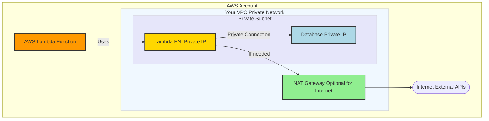
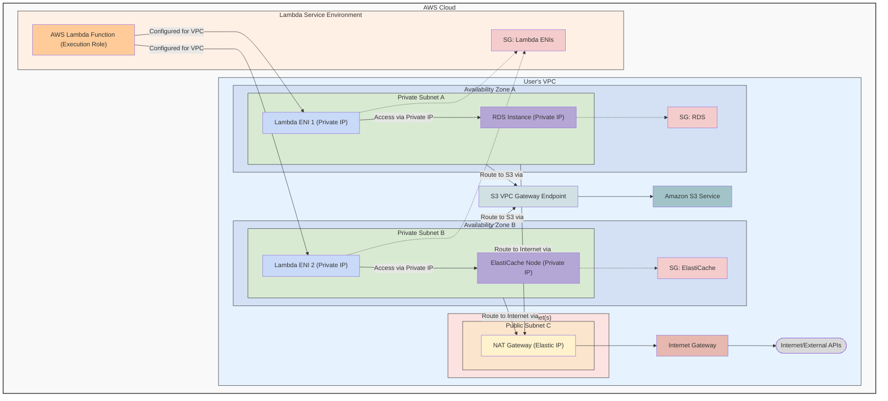

## Simple Example Lambda Arch

## More Complete Example Lambda Arch

### 1. Route Table for Private Subnets (PVT_SUBNET_A and PVT_SUBNET_B)

These subnets house your Lambda ENIs (ENI_A, ENI_B), the RDS instance (RDS_A), and the ElastiCache node (EC_B). They need to:
Access other resources within the VPC.
Reach the internet via the NAT Gateway.
Access Amazon S3 via the S3 VPC Gateway Endpoint.
The route table associated with PVT_SUBNET_A and PVT_SUBNET_B would have the following entries:
| Destination | Target | Purpose |
| :----------------- | :------------------------------------- | :---------------------------------------------------------------------- |
| 10.0.0.0/16 | local | Enables communication with all resources within the VPC. |
| 0.0.0.0/0 | nat-xxxxxxxx (ID of your NAT Gateway NAT_GW) | Routes all other outbound traffic (to the internet) to the NAT Gateway. |
| pl-yyyyyyyy (S3 Prefix List) | vpce-zzzzzzzz (ID of your S3 VPC Endpoint S3_VPCE) | Routes traffic destined for Amazon S3 to the S3 VPC Gateway Endpoint. |
- pl-yyyyyyyy: This is an AWS-managed prefix list ID that represents the IP address ranges for Amazon S3 in that specific AWS Region.

### 2. Route Table for the Public Subnet (PUB_SUBNET_C)

This subnet is "public" because it has a direct route to the Internet Gateway (IGW). The NAT Gateway (NAT_GW) itself resides in this subnet and uses this route table to send traffic to the internet.
The route table associated with PUB_SUBNET_C would have:
| Destination | Target | Purpose |
| :-------------- | :----------------------------------- | :--------------------------------------------------------------------------- |
| 10.0.0.0/16 | local | Enables communication with all resources within the VPC. |
| 0.0.0.0/0 | igw-aaaaaaaa (ID of your Internet Gateway IGW) | Routes all other outbound traffic directly to the Internet Gateway. |